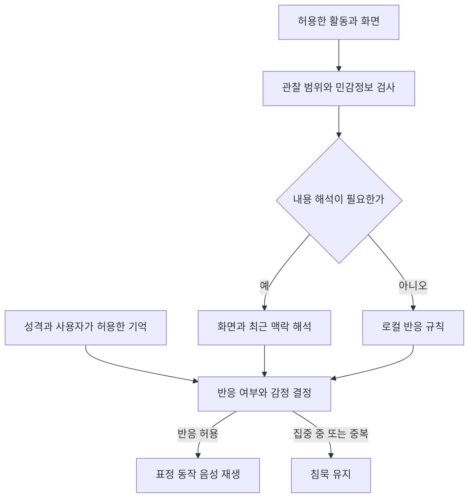

# 데스크톱 AI 버추얼 동반자 제품 기획안

유사 프로그램 조사 기준일 2026년 9월 11일

Live2D MVP 기술 구성과 범위 수정일 2026년 9월 21일

개발 코드명 제안 Ouento 오엔토

이 문서는 화면 오른쪽 아래에서 사용자의 컴퓨터 활동을 함께 보고, 성격에 맞는 말과 표정으로 반응하는 데스크톱 캐릭터 제품을 기획한다. 공식 개발 문서에서 확인한 사실과 설계 제안, 검증이 필요한 목표를 구분한다. 경쟁 제품이나 아래 기술 구성의 실기 성능을 측정한 보고서는 아니다.

**MVP는 Live2D로 제작하며 macOS와 Windows를 초기부터 함께 검증한다.** 기술 구성은 Tauri 2, Rust, Cubism SDK for Web의 Core와 Framework, HTML·CSS·JavaScript로 정한다. 공식 SDK와 샘플을 활용하는 캐릭터 제어 부분에는 TypeScript를 사용하고, 다른 영역에는 불필요하게 확대하지 않는다. 설정 화면은 추가 UI 프레임워크 없이 Web Components와 Shadow DOM을 활용한다. 화면 관찰은 운영체제 이벤트와 필요한 화면 해석을 결합한다. 제품의 중심 가치는 상황에 맞는 성격과 연기, 작업을 방해하지 않는 동행 경험이다. 3D·VRM 지원은 후속 개발로 미룬다.

확정된 MVP 범위는 Live2D 모델 가져오기, 커서 추적, 표정 변화, 말소리에 맞는 입 모양, 눈 깜박임, 작은 고개·상체 움직임, 머리카락 등의 물리 효과다. 걷기·춤·전신 행동 애니메이션과 실제 안구 시선 추적은 제외한다. 기본 검증 모델은 Niziiro Mao로 시작하며, 다른 사용자 모델은 제공하는 파라미터와 자산에 따라 지원 기능을 표시한다.

## 1 제품 정의와 첫 고객

**한 문장 정의:** 사용자가 허용한 화면과 활동을 함께 보며, 취향에 맞는 성격과 표정으로 반응하는 데스크톱 AI 동반자.

첫 고객은 PC에서 공부·개발·창작을 오래 하고, 애니메이션 캐릭터나 버추얼 캐릭터를 좋아하는 사람으로 설정한다. 이후 게임 동행, 영상 감상, 일정 관리로 확장한다. 이는 수요가 입증됐다는 뜻이 아니라 첫 테스트 대상을 좁히기 위한 가설이다.

앱 이름, 캐릭터 이름, 성격 프리셋은 별개로 둔다. 같은 모델에 다른 성격을 적용하거나, 모델을 바꾸면서 기억을 이어갈 수 있어야 한다. 외형을 바꿀 때에는 기존 인격을 유지할지 새 캐릭터로 시작할지 사용자가 선택한다.

기본 화면은 우측 하단의 이동 가능한 캐릭터, 짧은 말풍선, 클릭 시 펼쳐지는 메뉴로 구성한다. 메뉴에서 대화, 성격, 캐릭터 불러오기, 함께 보기, 조용히 있기, 관찰 중지를 바로 찾을 수 있어야 한다. 투명 영역은 마우스 클릭을 통과시키고 캐릭터 영역만 조작한다.

## 2 유사 프로그램 조사

아래 표의 기능은 공식 자료에 명시된 범위다. 미확인은 기능이 없다는 단정이 아니다. 특히 사용자가 전달한 스크린샷을 해석하는 기능과, 모든 PC 활동을 지속적으로 이해하는 기능은 구분해야 한다.

| 프로그램 | 확인된 관련 기능 | 모델과 배포 | 참고할 점과 한계 |
|---|---|---|---|
| [Phase Pal](https://store.steampowered.com/app/3655450/Phase_Pal/) | 음성 대화, 공유한 스크린샷 이해, 성격 조절, 반복 체크인, Minecraft 사건 반응 | 사용자 VRM, Steam 출시 | 가장 직접적인 상용 비교 대상. 모든 PC 사건의 자동 이해까지 확인된 것은 아님 |
| [Open-LLM-VTuber](https://github.com/Open-LLM-VTuber/Open-LLM-VTuber) | 화면·카메라 인식, 음성 대화와 중단, 선제 발화, 투명 데스크톱 모드, 감정 매핑 | 커스텀 Live2D, 공개 코드 | 기능 구현 참고의 우선순위가 높음. 현재 README에서 장기기억은 일시 제거됐다고 명시 |
| [Project AIRI](https://github.com/moeru-ai/airi) | 실시간 음성, 캐릭터 제어, 게임 연동, 여러 AI 연결 | Live2D와 VRM, 웹·데스크톱 공개 코드 | 두 형식을 함께 다루는 구조 참고. 개발 중 기능을 완성된 제품 성능으로 간주하지 않음 |
| [MateEngine](https://store.steampowered.com/app/3625270/MateEngine/) | 커서 반응, 드래그·터치, 음악 반응, 로컬 AI 텍스트 채팅 | 커스텀 VRM, Workshop, Steam | 상주 캐릭터 사용성 참고. 시각적 화면 내용 이해는 공식 확인 못 함 |
| [Desktop Mate](https://store.steampowered.com/app/3301060/Desktop_Mate/) | 창 위 캐릭터 동작, 커서 상호작용, 알람, 캐릭터별 음성·연동 | 공식 3D 캐릭터 DLC, Steam | 연기와 IP 상품화 참고. 자유로운 AI 대화·일반 모델 임포트는 공식 소개에서 미확인 |
| [Amica](https://github.com/semperai/amica) | 음성, 시각 기능, 감정과 표정 반응 | VRM, 공개 코드 | 3D 표정·음성을 연결하는 구조 참고. OS 전체 자동 관찰 범위는 미확인 |
| [VTube Studio](https://store.steampowered.com/app/1325860/VTube_Studio/) | Live2D 렌더링, 얼굴·마우스 추적, 립싱크, 표정·모션 | 사용자 Live2D, Steam | 캐릭터 표현 품질과 실험 도구 참고. 자체 AI 동반자 제품은 아님 |
| [VPet Simulator](https://store.steampowered.com/app/1920960/VPet) | 육성·터치·이동, 풍부한 애니메이션과 사용자 콘텐츠 | Workshop, 무료·공개 코드 | 일상 이벤트와 애착 경험 참고. 기본 제품의 화면 의미 이해는 미확인 |

MateEngine은 공식 소개 안에서 일부 VRM 버전과 창 위 앉기 기능의 지원 상태가 혼재하므로 상세 호환성을 참고할 때에는 실제 배포 빌드를 확인한다. Open-LLM-VTuber의 대화 로그 저장을 완성된 장기기억 기능으로 표현하지 않는다.

우선 참고 순서는 Phase Pal의 화면 반응과 사용자 경험, Open-LLM-VTuber의 음성·시각·표정 연결, AIRI의 캐릭터 구조, MateEngine의 데스크톱 사용성이다. 기능 수를 늘리기 전에 동일한 세 가지 상황에서 이 제품들과 비교해야 한다. 합격 결과를 보여주기, 다른 캐릭터의 영상을 보기, 30분간 아무 말 없이 작업하기가 적합하다.

## 3 차별화 방향

화면 인식과 AI 대화를 결합한 구현은 이미 있다. 다음 항목을 제품의 품질 목표로 삼는다.

| 가치 | 구체적인 구현 | 사용자가 판단할 수 있는 기준 |
|---|---|---|
| 일관된 성격 | 말투·표정 강도·발화 빈도·거리감을 함께 설정 | 같은 사건에 츤데레와 무심한 고양이가 분명히 다르게 반응 |
| 자연스러운 연기 | 시선 이동, 잠깐의 정적, 표정 전환, 음성을 하나의 반응으로 조정 | 웃는 표정으로 슬픈 대사를 읽는 불일치가 없음 |
| 적절한 침묵 | 집중·회의·영상 대사 중에는 발화를 억제 | 사용자가 앱을 켜둔 채 실제 작업을 계속할 수 있음 |
| 화면 관찰의 통제 | 허용 창 선택, 관찰 상태 표시, 즉시 중지 | 무엇을 보고 있는지 사용자가 설명할 수 있음 |
| 손쉬운 캐릭터 교체 | 파일 검증과 표정 미리보기, 누락 기능 안내 | 코드를 고치지 않고 자신의 캐릭터를 사용 |

한국어 말투의 자연스러움은 좋은 초기 검증 항목이다. 다만 한국어 지원 자체를 경쟁작에 없는 기능이라고 홍보하면 안 된다. 예를 들어 Phase Pal의 Steam 페이지는 한국어 지원을 표기한다. [Phase Pal 공식 Steam 페이지](https://store.steampowered.com/app/3655450/Phase_Pal/)

## 4 사용자가 제시한 상황의 구현 계획

| 상황 | 알아내야 하는 정보 | 반응 예시와 연출 | 우선순위 |
|---|---|---|---|
| 커서를 움직임 | 커서 위치 | 눈동자와 고개가 부드럽게 따라감 | 첫 데모 |
| 웹페이지를 엶 | 창 전환, 허용된 페이지의 제목·내용 | 작업 관련 화면인지 판단 후 필요한 경우 짧게 언급 | 초기 제품 |
| 글을 입력함 | 입력 중인지, 허용한 앱에서 완성된 글이 무엇인지 | 입력 중에는 조용히 지켜보고 멈춘 뒤 선택적으로 반응 | 초기 제품 |
| 볼륨을 줄이거나 음소거 | 실제 출력 장치의 볼륨·음소거 변화 | 고개를 갸웃하거나 작은 말풍선을 표시 | 양쪽 OS 기본 표시 검증 후 |
| 밝기를 바꿈 | 지원되는 디스플레이의 밝기 상태 | 화면이 어두워지면 졸린 듯한 동작 | 호환 기기부터 후속 |
| 창을 닫음 | 창 닫힘과 최소화의 구분, 이전 작업 맥락 | 작업 종료가 확실할 때 수고했다는 반응 | 초기 제품 |
| 다른 애니 캐릭터를 봄 | 캐릭터가 보인다는 사실과 관찰 지속 시간 | 설정된 경우 곁눈질 뒤 가벼운 질투 대사 | 초기 제품의 대표 장면 |
| 슬픈 영상을 함께 봄 | 최근 장면·대사·소리의 흐름 | 먼저 표정이 가라앉고, 대사가 끝난 뒤 짧게 반응 | 후속 |
| 합격 통지서를 봄 | 합격 여부, 누구의 결과인지, 문서 맥락 | 놀람에서 기쁨으로 전환한 뒤 축하 | 초기 제품의 대표 장면 |

음소거 시 같은 출력 장치로 말하면 사용자는 듣지 못한다. 이때에는 표정과 말풍선이 주된 피드백이 되어야 한다. 창 닫기를 곧 작업 완료로 단정해서도 안 된다. 잘못 연 창을 닫거나 프로그램이 종료된 것일 수도 있다.

합격 화면의 좋은 흐름은 다음과 같다. 화면에 합격이라고 쓰여 있지만 소유자가 불분명하면 “합격이라고 적혀 있는데, 네 결과야?”라고 묻는다. 사용자가 확인하면 놀란 표정에서 환한 웃음으로 바뀐다. “불합격”에 포함된 “합격”이라는 글자만 탐지해서 축하하는 구현은 실패 사례로 다룬다.

질투 반응은 사용자가 선택한 캐릭터 연출로 구현한다. 빈도와 강도를 설정하고 끌 수 있게 한다. 같은 화면을 볼 때마다 반복하지 않으며 다른 캐릭터를 봤다는 이유로 기능을 막거나 과금을 유도하지 않는다.

사용자는 ‘시선’이 마우스 커서 추적임을 확인했다. 전역 커서 위치를 캐릭터의 눈·고개 방향으로 변환하고 부드럽게 보간한다. 이를 위해 카메라나 매 프레임 AI 호출은 필요하지 않다.

## 5 화면 이해와 즉각 반응의 기술 구조

**설계 원칙:** 확실한 운영체제 사건은 운영체제에서 얻고, 내용 해석이 필요한 순간에만 시각·언어 모델을 호출한다.

| 정보 | 공식 기능과 근거 | 설계상 주의점 |
|---|---|---|
| 커서 위치 | 선택한 네이티브 창 모듈과 OS의 전역 커서 좌표 API | 창 바깥의 커서도 추적하고 모니터 배율을 보정 |
| 창·포커스·텍스트 변화 | [Windows UI Automation 이벤트](https://learn.microsoft.com/en-us/windows/win32/winauto/uiauto-eventsoverview), [SetWinEventHook](https://learn.microsoft.com/en-us/windows/win32/api/winuser/nf-winuser-setwineventhook) | 앱별 지원 차이와 중복 이벤트 처리 |
| 시스템 볼륨 | [Windows Endpoint Volume Controls](https://learn.microsoft.com/en-us/windows/win32/coreaudio/endpoint-volume-controls) | 앱 내부 동영상 볼륨과 구분 |
| 밝기 | [WmiMonitorBrightnessEvent](https://learn.microsoft.com/en-us/windows/win32/wmicoreprov/wmimonitorbrightnessevent), [DDC CI 조회](https://learn.microsoft.com/en-us/windows/win32/api/lowlevelmonitorconfigurationapi/nf-lowlevelmonitorconfigurationapi-getvcpfeatureandvcpfeaturereply) | 외부 모니터의 지원·정확성 보장 불가 |
| 선택한 화면 | [Windows Screen Capture](https://learn.microsoft.com/en-us/windows/apps/develop/media-authoring-processing/screen-capture) | 허용한 창·디스플레이 프레임 사용 |
| 허용 페이지 텍스트 | [Chrome Content Scripts](https://developer.chrome.com/docs/extensions/develop/concepts/content-scripts) | DOM에 없는 내용까지 읽는 것은 아님 |

이벤트에는 시각, 대상 앱, 사건 종류, 확실성, 정보 출처, 허용 범위를 붙인다. 빠르게 여러 창을 전환하면 잠깐 기다려 최종 활성 창만 해석한다. 같은 화면은 이미지 변화량이나 해시로 중복 호출을 줄인다. 화면 해석이 완료됐을 때 사용자가 이미 다른 화면으로 이동했다면 오래된 반응은 취소한다.

커서 따라보기와 호흡 같은 기본 움직임은 로컬에서 계속 재생한다. 사건에 대한 말과 몸짓은 로컬 규칙이 생성했더라도 공통 반응 조절을 거쳐 성격·집중 모드·반복 제한을 적용한다. 화면 분석에는 자기 캐릭터 창을 제외해 자신을 다른 캐릭터로 오인하는 반복을 막는다. Windows에는 창 캡처 제외와 관련된 [Display Affinity API](https://learn.microsoft.com/en-us/windows/win32/api/winuser/nf-winuser-setwindowdisplayaffinity)가 있으며, 실제 캡처 방식별 동작을 검증해야 한다.

브라우저 확장은 허용한 사이트에서 보이는 DOM 텍스트와 페이지 정보를 전달하는 후속 기능으로 둔다. 로그인 정보·결제 입력칸·비밀번호 필드는 제외한다. 다른 앱의 입력 내용은 접근성 API 제공 여부에 따라 읽을 수 있는 범위가 달라진다. ‘타이핑 중’ 감지는 가능해도 모든 프로그램에서 입력된 문장을 정확히 얻는다고 약속해서는 안 된다.

AI는 표정과 대사에 사용할 구조화된 결과를 반환하게 한다. 예를 들어 반응 여부, 대사, 감정, 강도, 시선 대상, 사용할 동작, 말하기 우선순위를 출력한다. 앱은 허용된 감정·동작 목록인지 검사한 뒤 실행한다. 화면 속 텍스트는 관찰 자료로 취급하며 앱의 지침이나 실행 명령으로 승격하지 않는다.

### MVP 개발 스택

| 영역 | 사용할 기술 | 담당 범위 |
|---|---|---|
| 데스크톱과 설정 UI | Tauri 2, HTML·CSS·JavaScript | 투명 캐릭터 창과 설정 창. React 등 추가 UI 프레임워크 없이 Web Components와 Shadow DOM 활용 |
| Live2D 실행 | Cubism SDK for Web의 Core와 Framework | 모델 계산, WebGL 렌더링, 표정·모션·눈 깜박임·호흡·물리 효과 |
| 캐릭터 제어 | 공식 샘플 기반 TypeScript 모듈 | 모델 로딩, 파라미터 매핑, 커서 추적, 감정과 동작 합성, 음성과 얼굴의 동기화 |
| 오디오와 립싱크 | Web Audio API, Cubism SDK MotionSync Plugin for Web | 실제 TTS 오디오 재생·분석과 입 모양 제어. MotionSync 설정이 없는 모델에는 음량 기반 입 개폐 제공 |
| 핵심 로직 | Rust | AI 연결, 성격·기억, 반응 결정, 파일과 설정 관리 |
| 투명 창과 클릭 통과 | Tauri 창 API와 OS별 연결 | 전역 커서, 배율, 항상 위 표시, 포커스, 캐릭터 클릭 영역 처리 |
| OS 활동과 화면 관찰 | 공통 인터페이스와 OS별 구현 | 창·오디오·접근성·캡처의 Windows 구현과 macOS 구현 분리 |
| 성격과 기억 | 로컬 SQLite 등 | 설정·요약 기억을 분리하고 열람·수정·삭제 가능하게 구성 |
| AI 연결 | 교체 가능한 제공자 인터페이스 | 텍스트·이미지 해석, 음성 인식, 음성 합성을 각각 교체 가능하게 구성 |

Cubism Web Framework는 자체 WebGL 렌더러를 제공한다. MVP에는 Three.js·three-vrm·PixiJS를 추가하지 않는다. 공식 Framework와 샘플의 TypeScript 코드는 빌드 후 JavaScript로 실행하며, 설정 UI와 Rust 핵심 로직은 독립적으로 유지한다. 구현의 출발점은 [Cubism Web Framework](https://github.com/Live2D/CubismWebFramework), [Cubism Web Samples](https://github.com/Live2D/CubismWebSamples), [Tauri 구조](https://v2.tauri.app/concept/architecture/)다.

Cubism Core는 공식 SDK 배포 패키지에서 확보하고, MotionSync에는 별도의 MotionSync Core도 준비한다. Core·Framework·샘플·MotionSync의 호환되는 안정 릴리스 조합과 모델 내보내기 버전을 각각 기록하고, 그 조합에서 읽을 수 있는 모델 형식을 지원 범위로 명시한다. 구성 요소의 릴리스 번호가 같다고 호환성을 가정하거나 최신 개발 브랜치·알파판을 자동으로 따라가지 않는다. [Cubism SDK for Web](https://docs.live2d.com/en/cubism-sdk-manual/cubism-sdk-for-web/), [MotionSync Web 구성](https://docs.live2d.com/en/cubism-sdk-manual/use-on-scene-motion-sync-web/)

SDK의 업데이트 스케줄러와 모델 갱신 방식은 고정한 릴리스의 공식 샘플을 기준으로 통합한다. Cubism 5 SDK R5 Web에서는 프레임 갱신을 Framework의 `CubismUpdateScheduler`로 옮겼으므로, 과거 예제의 수동 갱신과 스케줄러를 함께 실행해 효과를 중복 적용하지 않는다. [R5 갱신 구조](https://docs.live2d.com/en/cubism-sdk-manual/compatibility-with-cubism-5-3-official/)

캐릭터는 WebView 안의 투명 canvas에 그린다. 모델 계산과 렌더링을 하는 모듈, 감정·커서·립싱크를 조합하는 연출 모듈, Rust와 메시지를 주고받는 연결 모듈을 분리한다. AI는 모델의 실제 파라미터 ID를 직접 제어하지 않고 감정·강도·대사·시선 대상·동작 의도를 전달한다. 후속 3D 지원 때에도 이 메시지 형식을 재사용한다.

렌더러와 Rust 사이에는 반응 시작·취소, 모델 변경, 오디오 준비 등 의미 있는 메시지를 전달한다. 눈 깜박임과 물리 효과의 매 프레임 값을 왕복시키지 않는다. 전역 커서 좌표는 필요한 빈도로 전달하고 캐릭터 제어 모듈에서 보간한다. Node는 빌드 도구로 사용하며, 제품 실행에 별도 Node 서버나 Python 보조 프로세스를 추가하지 않는다.

오디오 재생의 기준 시각은 Web Audio의 재생 시계로 통일한다. TTS 결과에는 발화 ID를 붙여 음성·자막·입 모양을 함께 시작·취소한다. MotionSync 분석에는 캐릭터가 재생할 TTS 오디오를 전달한다. 사용자 마이크와 영상 함께 보기 오디오를 캐릭터 립싱크 입력에 섞지 않는다. 구체적인 입 모양과 표정의 합성 기준은 13절에 둔다. [MotionSync Web](https://docs.live2d.com/en/cubism-sdk-manual/cubism-sdk-motionsync-plugin-for-web/)

## 6 성격과 감정과 외형을 분리하기

성격은 장기적으로 유지되는 설정이고 감정은 사건에 따라 변하는 상태다. 외형은 그 상태를 보여주는 모델이다. 긴 프롬프트 하나에 셋을 모두 넣으면 사용자 커스텀과 오류 분석이 어려워진다.

| 설정 층 | 예시 | 변화 방식 |
|---|---|---|
| 성격 | 다정함, 무심함, 장난기, 수줍음, 존댓말, 질투 허용 | 사용자가 수정 |
| 현재 기분 | 평온함, 즐거움, 서운함, 긴장 | 사건에 따라 바뀌고 시간이 지나면 완화 |
| 즉각 반응 | 놀라 눈을 크게 뜸, 미소, 한숨, 고개 돌리기 | 짧은 시간에 실행 |
| 기억 | 사용자가 직접 알려준 시험 일정과 목표 | 저장 여부를 사용자가 통제 |

슬라이더만 제공하지 말고 성격 미리보기 버튼을 넣는다. 동일한 합격 장면을 보여주며 대사와 표정을 확인하게 하면 사용자가 원하는 성격을 빨리 찾을 수 있다.

대사 방향의 예시는 츤데레는 “붙었네. 그렇게 준비했으니까… 축하해.”, 무심한 고양이는 “합격이네. 잘했어.”, 응원단은 “해냈다! 정말 잘했어!”이다. 실제 구현에서는 대사의 길이뿐 아니라 고개 움직임과 표정 강도도 함께 달라진다. 이 문장들은 설계 예시이며 고정 대본 전체가 제품은 아니다.

‘질투’는 모든 모델에 존재하는 표정 이름이 아니다. 모델의 표정 목록에서 약한 불만, 시선 회피, 고개 돌리기 등을 조합하고 부족한 자산은 별도로 제작해야 한다. AI가 happy나 jealous를 출력한다고 모델에 없는 표정이 자동으로 생기지 않는다.

음성과 얼굴은 하나의 재생 시간축으로 맞춘다. 발화가 시작되기 전에 필요한 표정을 준비하고, 말하는 동안 입 모양과 눈 깜빡임을 유지하고, 끝난 뒤 천천히 기본 상태로 돌아온다. 사용자가 말하기 시작하면 음성을 중단하고 듣는 동작으로 전환한다. 애니메이션은 계속 부드럽게 재생하되 AI 추론 빈도는 별도로 제한한다.

## 7 Live2D 모델과 사용자 파일 지원

### 실행용 파일과 지원 범위

MVP는 Cubism의 `.model3.json`을 진입점으로 하는 실행용 모델 묶음을 지원한다. 모델 폴더를 선택하거나 드래그해서 가져오며, ZIP은 안전하게 압축을 풀어 동일한 검증 과정을 거친다. 여러 모델 설정 파일이 있으면 사용할 모델을 선택하게 한다. 편집 원본을 앱에서 직접 리깅하거나 내보내는 기능은 만들지 않는다.

| 파일 | 용도 | 가져오기 처리 |
|---|---|---|
| `.model3.json` | 모델과 관련 자산의 참조 목록 | 필수. 상대 경로를 기준으로 나머지 파일을 찾음 |
| `.moc3`와 텍스처 이미지 | 리깅된 모델 데이터와 외형 | 필수. 지원 버전·정합성·텍스처 크기 확인 |
| `.exp3.json` | 미리 만든 표정 | 제공되면 표정 목록에 등록. 없으면 기존 파라미터 조합으로 가능한 범위에서 설정 |
| `.motion3.json` | 대기 동작·끄덕임 등 | 선택. 전신 동작은 MVP 자동 재생 대상에서 제외 |
| `.physics3.json` | 머리카락·장식 등의 물리 효과 | 선택. 없으면 해당 이차 흔들림은 제공하지 않음 |
| `.pose3.json` | 파츠 표시 상태와 전환 설정 | 제공되는 모델에서 사용. 전신 행동 생성 기능으로 취급하지 않음 |
| `.cdi3.json` | 파라미터·파츠 등의 표시용 정보 | 있으면 설정 UI의 이름과 분류에 활용 |
| `.motionsync3.json` | MotionSync와 모델 파라미터의 연결 설정 | 대응하는 모델과 함께 검증한 경우 고급 립싱크에 사용 |
| `.cmo3`·`.can3`·PSD·단독 PNG | 편집 원본·모션 프로젝트·원화 | 직접 실행 대상에서 제외. 실행용 묶음이 필요하다고 안내 |

`.exp3.json`이나 `.physics3.json`이 없어도 모델 표시 자체는 가능할 수 있다. 다만 기본 검증 모델에는 표정·입 모양·커서 추적·대기 움직임·물리 효과를 모두 갖추고, 사용자 모델의 기능 누락은 가져오기 단계에서 표시한다. 파일 형식이 같아도 지원하는 기능이 같다고 간주하지 않는다. [모델 구성과 로딩](https://docs.live2d.com/en/cubism-sdk-manual/model-web/)

가져오기는 파일 검사 → 모델 로딩 → 기능 감지 → 감정·입 모양 미리보기 → 설정 저장 순서로 진행한다. 경로 이탈·심볼릭 링크를 통한 폴더 밖 접근·임의 외부 URL 참조를 차단하고, 압축 해제 크기·파일 수·텍스처 크기에 상한을 둔다. 현재 Core가 지원하는 정합성 검사를 적용하고, 참조 파일이 빠졌거나 모델 버전이 맞지 않으면 누락 항목을 안내한다. 실행 파일이나 사용자 스크립트를 모델 팩에서 실행하지 않는다. 모델 파일은 검증 후 앱의 관리 폴더에 복사하고, 제한된 자산 경로로만 렌더러에 제공한다.

사용자별 모델 설정에는 실제 파라미터 ID, 값 범위와 기본값, 감정별 표정·파라미터 조합, 입 모양 매핑, 추적 강도, 표시 크기·위치를 저장한다. `.model3.json`의 EyeBlink·LipSync 그룹과 공식 권장 파라미터 ID를 자동 연결의 후보로 활용하되, 다른 ID를 쓰거나 그룹이 없는 모델은 미리보기 화면에서 수동 연결할 수 있게 한다. 성격 프리셋과 이 모델별 연결 설정은 분리하며, 모델 교체 시 원래 모델의 파라미터 ID를 재사용하지 않는다. 성격 팩에는 대화 원문과 API 키를 포함하지 않는다.

VTube Studio 전용 핫키·트래킹 설정은 MVP에서 자동 변환하지 않는다. 그 앱에서 정상 작동하는 모델이라도 Ouento에서는 감정·입 모양·커서 반응을 따로 연결하고 확인한다. 3D·VRM 가져오기와 Workshop 연동은 후속 범위다.

### 개발에 사용할 무료 샘플 모델

| 모델 | 공식 제공 기능 | 프로젝트에서의 역할 |
|---|---|---|
| [Niziiro Mao](https://www.live2d.com/en/learn/sample/niziiro-mao/) | VTuber용 정면 모델, 넓은 얼굴 가동 범위, 입·눈썹의 Blend Shape, 표정·모션·물리 설정 | 첫 데모의 기본 검증 모델. 감정 연출과 커서 추적, 표정·발화 동시 재생을 우선 구현 |
| [Haru](https://www.live2d.com/en/learn/sample/haru/) | 표정·모션·물리 설정과 실행용 묶음 | 다른 모델에서도 감정 매핑과 대기 동작이 작동하는지 검증 |
| [Kei](https://www.live2d.com/en/learn/sample/kei/) | MotionSync 학습용 모델, 프리셋별 입 구조와 `.motionsync3.json` | TTS 오디오 분석과 입 모양 동기화의 기준 모델 |

Mao로 시작하되 제공된 모든 표정이 앱의 감정 목록과 일치한다고 가정하지 않는다. 먼저 기쁨·슬픔·놀람·약한 불만·평온함을 미리보기하고, 사용할 표정과 파라미터 조합을 기록한다. 마법 효과용 일부 모션은 일반 표정과의 병용에 제약이 있으므로 자동 감정 연출에서는 제외한다. 질투는 약한 불만·시선 회피·고개 기울임을 조합하는 앱의 연출로 만든다.

Kei에서 MotionSync 입력과 타이밍을 검증한 뒤 기본 모델에 맞는 입 파라미터 연결을 준비한다. Kei의 설정을 다른 모델에 그대로 복사하지 않는다. 무료 샘플의 실행용 데이터부터 활용하고, 새 표정에 필요한 변형 자체가 없을 때만 Cubism Editor에서 리깅 보완을 검토한다. AI가 모델에 없는 변형을 자동으로 만드는 기능은 MVP에 포함하지 않는다.

## 8 영상 함께 보기 — 후속 범위

슬픈 장면을 이해하려면 얼굴이 우는 스크린샷 한 장보다 앞뒤 대사가 도움이 된다. 초기 동시 시청 모드는 사용자가 선택한 영상 창, 현재 재생 지점 주변의 이용 가능한 자막, 필요한 경우 짧은 오디오 구간과 장면 표본을 묶어 해석한다. 모든 영상 서비스에서 자막·오디오·화면 캡처가 동일하게 제공되지는 않는다.

처음에는 사용자 소유 영상이나 허용된 로컬 영상으로 검증한다. 자막이 없는 영상은 음성 인식 비용과 지연이 추가된다. 보호된 영상의 검은 화면 문제를 우회하는 기능은 제품 범위에 넣지 않는다. 이야기를 이미 알고 있는 모델이 미래 줄거리를 말하지 않도록 현재까지 관찰한 범위만 사용한다.

Windows의 기본 [WASAPI loopback](https://learn.microsoft.com/en-us/windows/win32/coreaudio/loopback-recording)은 출력 혼합음을 얻을 수 있다. 특정 앱의 소리만 다룰 때에는 [Application Loopback 샘플](https://learn.microsoft.com/en-us/samples/microsoft/windows-classic-samples/applicationloopbackaudio-sample/)과 지원 OS를 확인한다. 캐릭터 자신의 음성이 다시 입력되어 혼잣말을 반복하지 않도록 제외 처리가 필요하다.

반응은 표정 우선, 음성은 대사 공백이나 사용자의 요청 시에만 내보내는 방식으로 시작한다. 먼저 1분 내외의 서로 다른 감정 장면에서 ‘너무 늦음’, ‘대사를 가림’, ‘문맥 오해’, ‘스포일러’를 측정하고 범위를 확장한다.

## 9 관찰 범위와 지속 실행 품질

사용자는 관찰 안 함, 선택한 창만 함께 보기, 허용 앱의 사건과 화면을 보고 먼저 반응하기 중에서 고를 수 있게 한다. 클라우드 분석을 선택하면 화면의 어느 부분과 어떤 정보가 전달되는지 먼저 보여준다.

기본 저장 대상은 설정과 사용자가 허용한 요약 기억이다. 원본 화면·키 입력·음성을 계속 저장하는 방식은 기본값으로 두지 않는다. 기억은 열람·수정·삭제할 수 있게 하고, 시험 일정 같은 정보는 만료 시점을 둔다. 화면 마스킹은 오탐과 누락이 있으므로 민감 앱 차단과 관찰 범위 제한을 함께 사용한다.

데스크톱 동반자의 품질은 낮은 지연뿐 아니라 계속 켜둘 수 있는가에 달려 있다. 창 포커스를 빼앗지 않기, 다중 모니터·배율 처리, 화면 잠금·절전·복귀, 네트워크 오류 후 중복 발화 방지, 음소거 상태에서 말풍선 표시를 초기 검증에 포함한다.

## 10 개발 순서와 MVP 판단 기준

프론트엔드 경험이 있는 개인 개발자가 주 15시간부터 20시간 작업하고 기존 AI 서비스를 활용한다는 가정이다. 아래 기간은 일정 산정을 위한 가설이며, macOS·Windows의 첫 Live2D 데모 결과로 다시 조정한다. 새 원화·리깅 제작 시간은 포함하지 않는다.

| 단계 | 예상 기간 | 결과물과 완료 조건 |
|---|---|---|
| 실행 환경 구성 | 1주에서 2주 | 호환 SDK 버전 고정, Mao 로딩, 양쪽 OS의 투명 창·항상 위 표시·클릭 통과 검증 |
| 캐릭터 작동 데모 | 추가 2주에서 4주 | 커서 추적, 표정 버튼, 눈 깜박임·호흡·작은 고개·상체 움직임·물리 효과, 실제 오디오 립싱크 |
| 핵심 경험 구현 | 추가 4주에서 6주 | 선택 화면 이해, 텍스트·음성 대화, 성격 3종, 발화 중단, 민감 앱 제외, 중복 반응 억제 |
| 사용자 모델과 비공개 알파 | 추가 4주에서 8주 | 모델 가져오기·매핑·미리보기, 기억 설정, 다중 모니터, 오류 복구, 두 OS의 성능과 장시간 실행 검증 |

대략 11주부터 20주의 개발 가정으로 시작하되, 초기 창 처리와 립싱크 검증 결과를 기준으로 조정한다. 3D 지원, 모든 앱의 입력 이해, 실제 눈동자 추적, 모든 영상 서비스 동시 시청, 자체 음성 학습은 별도 후속 범위다. MVP는 기본 모델에서의 완성도와 사용자 모델의 기능 차이를 안내하는 능력을 함께 검증한다.

다음 수치는 이미 달성한 성능이나 산업 표준이 아니라 개발 목표다.

| 검증 항목 | 목표 또는 판단 방식 |
|---|---|
| 데스크톱 동작 | 두 OS에서 투명 배경·포커스 유지·클릭 통과·캐릭터 드래그·잠금 복귀 확인 |
| 로컬 반응 속도 | 커서와 지원되는 볼륨 사건의 시각적 반응이 대체로 100ms 안에 시작하는지 측정 |
| 화면 이해 반응 | 첫 의미 있는 반응 2초부터 5초 목표. 모델·네트워크 조건, 중간값과 95백분위 함께 기록 |
| 캐릭터 연기 | 기본 모델이 13절의 표정·눈·고개·상체·립싱크·물리 효과 조건을 모두 충족 |
| 립싱크 | 짧은 한국어 문장과 무음·일시정지·중단에서 입의 시작·종료와 모양 전환 확인. 장기 재생 시 지연 누적 측정 |
| 성격 구분 | 동일 장면에서 말투뿐 아니라 표정 강도와 동작 차이로 프리셋을 구분할 수 있는지 확인 |
| 관찰 신뢰성 | 허용하지 않은 창의 화면이 전송되지 않는지 명시적 테스트 |
| 모델 호환 | 먼저 Mao·Haru·Kei를 확인하고, 알파에서 서로 다른 모델 최소 10개로 확장. 정상 로딩·기능 제한·오류 안내를 구분 |
| 자원 사용 | 기본 모델의 대기·발화·화면 분석을 분리해 CPU·GPU·전체 메모리·프레임 안정성 기록 |
| 지속 사용 | 테스트 사용자 10명부터 20명에게 1주 사용하게 하고, 30분 이상 작업 중 계속 켜두는지와 끈 이유 수집 |

첫 시연 영상은 30초부터 45초로 구성한다. 커서 따라보기, 다른 캐릭터에 곁눈질, 합격 화면 축하, 성격 전환, 사용자 Live2D 모델 가져오기 순서가 좋다. 실제 대사·표정·반응 지연을 보여주고 실제 속도의 장면을 포함한다.

## 11 지금 시작할 작업

첫 실험은 AI 없이 Mao 한 명을 macOS와 Windows의 우측 하단에 표시하는 것이다. 기능을 다음 순서로 연결한다.

1. Tauri 투명 창에 Cubism 공식 샘플을 옮기고, 배포 빌드에서 모델·텍스처·셰이더 등 자산 경로를 확인한다.
2. 두 OS의 전역 커서를 모델 좌표로 변환하고 눈·고개가 부드럽게 따라보게 한다. 투명 영역 클릭 통과와 캐릭터 드래그를 확인한다.
3. 표정 버튼으로 기쁨·슬픔·놀람·약한 불만·평온함을 재생하고, 깜박임·호흡·작은 상체 움직임·물리 효과를 겹쳐 확인한다.
4. 고정된 한국어 TTS 음원을 재생해 음량 기반 입 개폐를 연결한다. 이어 Kei로 MotionSync를 검증하고 기본 모델에 맞는 입 모양 연결을 준비한다.
5. AI 텍스트 대화와 성격 3종을 연결하고 발화 취소 시 음성·자막·입 모양이 함께 멈추게 한다.
6. 사용자가 선택한 합격 결과 화면에 성격별 대사와 표정을 적용한 뒤, 다른 모델 가져오기와 기능 누락 안내를 확인한다.

표정과 음성이 어색하거나 계속 켜두기 부담스럽다면 화면 관찰 범위를 늘리기 전에 기본 캐릭터 연기와 침묵 규칙을 개선한다.

## 12 Live2D 상주 성능과 자원 관리

캐릭터는 Tauri의 투명 WebView 안에서 Cubism의 WebGL 렌더러로 표시한다. 화면에 한 명만 보이더라도 WebView·모델 계산·물리·텍스처·마스크·투명 창 합성의 비용은 남는다. 성능은 Windows와 macOS의 실제 배포 빌드에서 측정한다. 이 문서에는 실기 측정 결과가 없다.

초기 기본값은 30 FPS로 두고 60 FPS를 선택할 수 있게 한다. 프레임 수에 따라 움직임 속도가 달라지지 않도록 경과 시간을 사용하며, 절전 복귀 후 큰 시간 간격이 물리 계산에 한꺼번에 들어가지 않게 처리한다. 모니터 배율과 canvas 해상도를 구분하고 고해상도 디스플레이의 과도한 픽셀 수를 제한한다. 숨김·화면 잠금 시에는 불필요한 렌더링과 자동 화면 관찰을 멈춘다.

전체 화면 크기의 투명 canvas 대신 캐릭터와 말풍선에 필요한 크기부터 사용한다. 상반신만 보이게 잘라도 원본 텍스처·변형·물리 계산 비용이 자동으로 줄어드는 것은 아니다. 기본 모델의 큰 텍스처와 복잡한 마스크·효과를 점검하고, 사용자 모델은 검증된 자원 한도를 넘으면 안내한다. 성능 조정으로 표정이나 마스크가 깨지지 않는지 함께 확인한다.

| 측정 상태 | 분리해서 확인할 항목 |
|---|---|
| 대기 | 호흡·깜박임·물리 효과의 기본 CPU·GPU 비용 |
| 커서 추적 | 전역 좌표 전달 빈도, 보간 지연, 과도한 IPC 여부 |
| 발화 | 오디오 재생·분석·표정 합성과 입 모양의 지연 |
| 화면 관찰 | 캡처·이미지 처리·AI 호출을 추가했을 때의 비용 |
| 모델 교체 반복 | 기존 모델·텍스처·오디오·이벤트 구독 해제, 메모리 증가 여부 |
| 잠금·절전 복귀 | 캔버스·오디오·물리 상태 복구, 중복 발화와 급격한 움직임 여부 |

같은 모델·표시 크기·음원·30/60 FPS 조건에서 두 OS를 비교하고, 메인 프로세스와 WebView 자식 프로세스를 포함한 전체 메모리·CPU/GPU 시간·프레임 안정성·가능한 전력 지표를 기록한다. SDK 자체가 요구하는 구성 외에 별도 WebAssembly 모듈을 추가하는 것은 실제 병목이 확인된 경우에만 검토한다.

## 13 Live2D 캐릭터 연기와 완료 조건

전신 애니메이션을 제외해도 아래 표현은 기본 모델에서 모두 구현한다. AI는 대사와 감정·강도·동작 의도를 정하고, 매 프레임 움직임은 로컬 컨트롤러가 만든다. 파라미터 ID와 값 범위는 가져온 모델에서 확인하며 아래 이름은 공식 권장 예시다. 모든 모델에 같은 ID가 있거나 같은 움직임이 구현되어 있다고 가정하지 않는다.

| 표현 | 사용할 파라미터·자산 예시 | 완료 조건 |
|---|---|---|
| 커서 따라보기 | `ParamEyeBallX/Y`, `ParamAngleX/Y/Z` | 눈이 먼저 움직이고 고개가 부드럽게 따라감. 각도 제한·모니터 배율·창 이동 반영 |
| 눈 깜박임 | `ParamEyeLOpen`, `ParamEyeROpen` | 불규칙한 간격으로 재생하며 감정이 눈을 감고 있을 때 충돌하지 않음 |
| 대기 움직임 | `ParamBreath`, 모델의 몸 각도 파라미터, 작은 대기 모션 | 호흡·고개·상체가 작게 움직이며 단일 주기의 기계적 반복을 피함 |
| 표정 전환 | `.exp3.json`, 눈썹·눈·입 형태 파라미터 | 기본 감정과 강도를 부드럽게 전환하고 평온 상태로 돌아올 때 이전 표정이 남지 않음 |
| 립싱크 | `ParamMouthOpenY`, `ParamMouthForm` 등 모델별 입 파라미터 | 실제 오디오에 맞춰 입 모양 변화. 무음·중단 시 닫히고 웃거나 슬픈 표정 중에도 작동 |
| 발화 몸짓 | 얼굴·몸 각도 파라미터, 짧은 `.motion3.json` | 끄덕임·고개 기울임이 작은 범위로 실행되고 커서 추적과 충돌하지 않음 |
| 이차 흔들림 | `.physics3.json`과 모델의 물리 입력·출력 | 고개·몸 움직임에 따라 머리카락·장식이 자연스럽게 반응하고 복귀 시 튀지 않음 |

공식 근거: [표준 파라미터 목록](https://docs.live2d.com/en/cubism-editor-manual/standard-parameter-list/), [호흡](https://docs.live2d.com/en/cubism-sdk-manual/breath/), [물리 효과](https://docs.live2d.com/en/cubism-sdk-manual/physics/).

### 표정과 움직임의 합성

대기 동작·커서 추적·반응 몸짓·감정·깜박임·립싱크가 같은 파라미터를 동시에 바꾸므로, 모델별로 제어 대상과 우선순위를 정한다. 선택한 SDK 릴리스의 공식 갱신 방식에 맞춰 구성하며, 임의의 호출 순서만으로 모든 모델을 처리하지 않는다.

- 눈을 감는 감정은 자동 깜박임보다 우선한다. 입 벌림과 감정용 입 형태는 가능한 한 분리한다.
- 발화 중에는 대기 모션의 입 벌림 제어를 억제하고 립싱크가 담당한다. 입 형태를 공유하는 표정은 모델별 합성 강도를 조절한다.
- 반응 때문에 고개를 돌릴 때는 커서 추적 강도를 낮춘 뒤 서서히 복원한다. 모든 목표를 단순히 더해 최대 각도에 붙지 않게 한다.
- 물리 입력이 되는 고개·몸 값을 준비한 뒤 SDK가 물리 효과를 계산하게 하며, 물리 출력 파라미터를 대기 동작이 다시 덮어쓰지 않게 한다.
- 표정의 더하기·곱하기·덮어쓰기 방식과 페이드 설정을 확인하고, 이전 프레임의 가산 효과가 계속 누적되지 않게 기본 상태를 관리한다.

질투·수줍음·응원 같은 연출은 내부 의미를 모델의 실제 표정과 동작으로 연결하는 프리셋으로 저장한다. 필요한 변형이 없는 모델에서는 대체 표정을 선택하거나 제한을 알린다. [표정 모션의 합성](https://docs.live2d.com/en/cubism-sdk-manual/expression/)

### TTS 립싱크의 구현 단계

첫 작동 확인은 Web Audio에서 재생하는 TTS 음원의 음량을 분석해 입 개방 정도에 반영한다. 잡음 수준의 작은 신호에서는 입이 떨리지 않게 하고, 열고 닫는 속도를 부드럽게 조정한다. 문자열 길이나 임의의 반복 타이머로 입을 움직이지 않는다. 이 단계만으로 발음별 입 모양을 구현했다고 판단하지 않는다. [기본 립싱크](https://docs.live2d.com/en/cubism-sdk-manual/lipsync/)

기본 모델의 표현 품질을 높이기 위해 Cubism SDK MotionSync Plugin for Web을 연결한다. Kei의 설정과 음원으로 입력 분석을 검증한 뒤, 기본 모델의 실제 입 구조에 맞는 `.motionsync3.json`과 매핑을 준비하고 `.model3.json`의 참조에 연결한다. 플러그인은 입력 오디오를 분석해 준비된 모델 파라미터를 제어하며, 없는 입 모양을 새로 만들지는 않는다. 한국어 문장으로 입 모양·지연·무음 처리를 직접 평가한다. [MotionSync 설정](https://docs.live2d.com/en/cubism-sdk-manual/motion-sync-setting-web/), [Web 적용 예제](https://docs.live2d.com/en/cubism-sdk-manual/use-on-scene-motion-sync-web/)

사용자 모델에 고급 입 모양 연결이 없으면 음량 기반 입 개폐로 동작하고 지원 수준을 표시한다. 기본 모델은 입 개방과 형태 변화가 감정 표정과 함께 자연스럽게 보이는 것을 완료 조건으로 삼는다. 대사 중단·새 발화·모델 변경 시 기존 오디오와 분석 결과를 함께 취소하고 입을 닫는다. 일시정지나 스트리밍 버퍼 부족 때에도 재생과 입 모양을 함께 멈추고, 취소된 발화 ID로 늦게 도착한 오디오 조각은 버린다. 사용자 마이크는 별도의 대화 입력 기능으로 관리하며 립싱크 샘플 코드가 자동으로 활성화하지 않게 한다.

완료 검증에는 ‘눈을 감은 표정으로 말하면서 커서 추적’, ‘말하는 도중 취소’, ‘발화 중 모델 교체’, ‘배율이 다른 모니터로 이동’을 포함한다. 개별 기능이 단독으로 작동하는 것에 더해, 동시에 실행되거나 중단될 때의 자연스러움을 확인한다.

## 14 플랫폼 공통 코드와 운영체제별 구현

Windows 실행 파일과 macOS 앱은 각각 빌드한다. Live2D 모델·표정 매핑·성격·대화·반응 규칙은 공유하고, 화면 캡처·창 이벤트·볼륨·밝기·전역 커서·접근성 연동은 OS별 어댑터로 구현한다. Linux는 후속 범위로 둔다.

Tauri는 Windows에서 WebView2, macOS에서 WebKit을 사용한다. 같은 Cubism SDK·모델·TTS 음원을 두 환경의 실제 배포 빌드에서 검증한다. 브라우저에서 실행됐다는 사실만으로 투명 데스크톱 창에서도 검증됐다고 판단하지 않는다. [WRY 플랫폼 구성](https://github.com/tauri-apps/wry)

macOS의 투명 창에는 Tauri의 `macOSPrivateApi` 설정과 관련 기능 구성을 확인한다. 배경을 투명하게 만드는 것, 항상 위에 표시하는 것, 클릭을 통과시키는 것, 포커스를 받지 않는 것은 각각 구현·검증한다. [Tauri 창 설정](https://v2.tauri.app/reference/config/#windowconfig)

전역 커서 좌표는 모니터 배율과 창 위치를 반영해 canvas와 모델 좌표로 바꾼다. 캐릭터 창 바깥이나 클릭 통과 상태에서도 Rust의 전역 커서 수집을 계속 사용할 수 있어야 한다. WebView의 `mousemove` 이벤트만으로 전역 추적을 구현하지 않는다.

클릭 통과는 CSS의 `pointer-events`만으로 끝내지 않는다. 네이티브 창의 입력 통과 상태와 모델의 클릭 영역을 연결하고, 캐릭터를 클릭·드래그할 때만 필요한 입력을 받는다. 초기 클릭 판정은 설정된 상호작용 영역으로 검증한다. Cubism 샘플의 기본 hit test는 지정 메쉬의 사각 경계 검사이므로 캐릭터 실루엣과 정확히 일치하지 않으며, 투명 여백까지 클릭을 가로채는지 확인한다. 창 전체 입력 통과 API만 사용하는 경우 영역 판정과 상태 전환을 별도로 구현하고, 드래그 중에는 통과 상태가 바뀌지 않게 유지한다. 픽셀 정밀 판정이 필요해도 매 프레임 GPU 픽셀 읽기를 기본값으로 삼지 않는다. [Tauri 입력 통과 API](https://v2.tauri.app/reference/javascript/api/namespacewindow/#setignorecursorevents), [Cubism 모델 샘플](https://github.com/Live2D/CubismWebSamples/blob/develop/Samples/TypeScript/Demo/src/lappmodel.ts)

OS 어댑터는 각 플랫폼의 사건을 ‘활성 앱 변경’, ‘출력 음소거 변경’ 같은 공통 사건으로 전달한다. 지원되지 않는 사건은 명시하고 화면 추론만으로 확정하지 않는다. macOS의 화면 녹화·접근성 권한은 해당 기능을 켤 때 요청하고, 권한이 없어도 캐릭터 표시와 직접 대화는 가능하게 한다. Windows에서도 캡처와 이벤트 수집 실패가 캐릭터 렌더링을 멈추지 않게 한다.

두 OS의 공통 확인 항목은 투명도, 가장자리 합성, 커서와 드래그, 다중 모니터·혼합 배율, 다른 앱의 입력 유지, TTS 시작·중단, 모델 교체, 화면 잠금·절전 복귀다. 개발 서버에서는 정상이지만 배포 앱에서 모델이나 셰이더 파일을 못 읽는 문제가 없는지도 확인한다.
